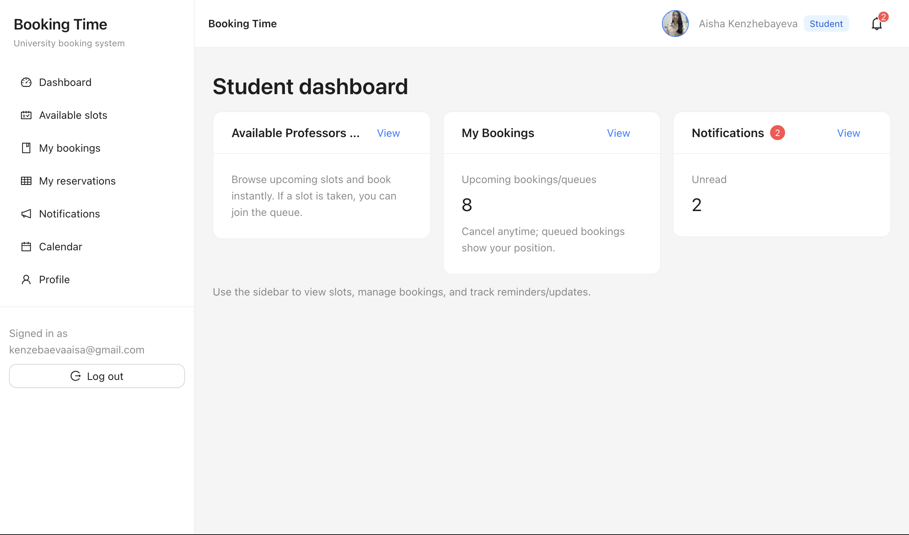
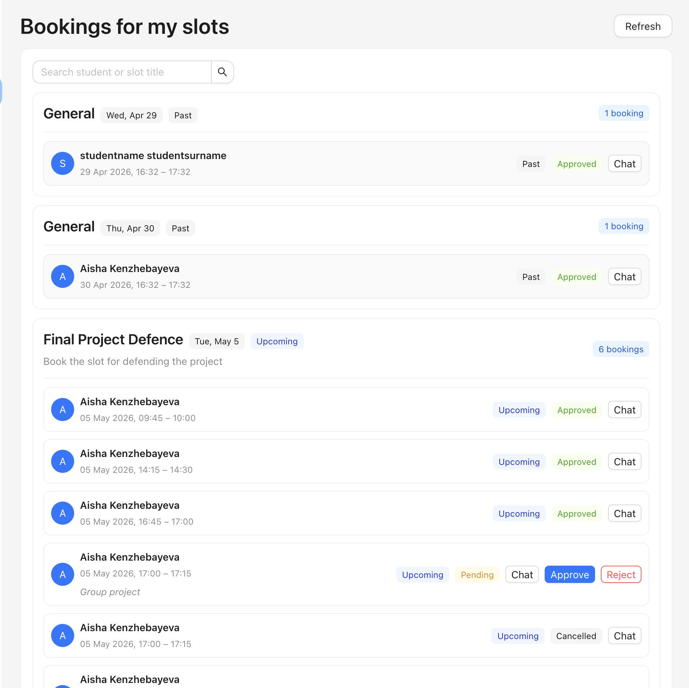
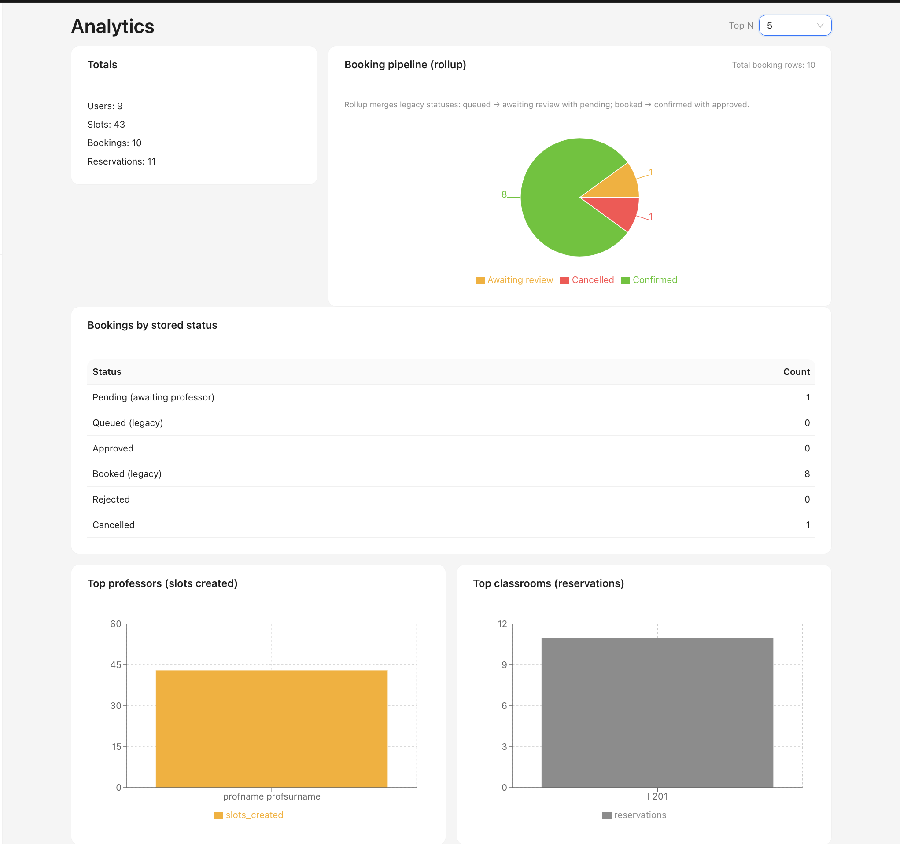
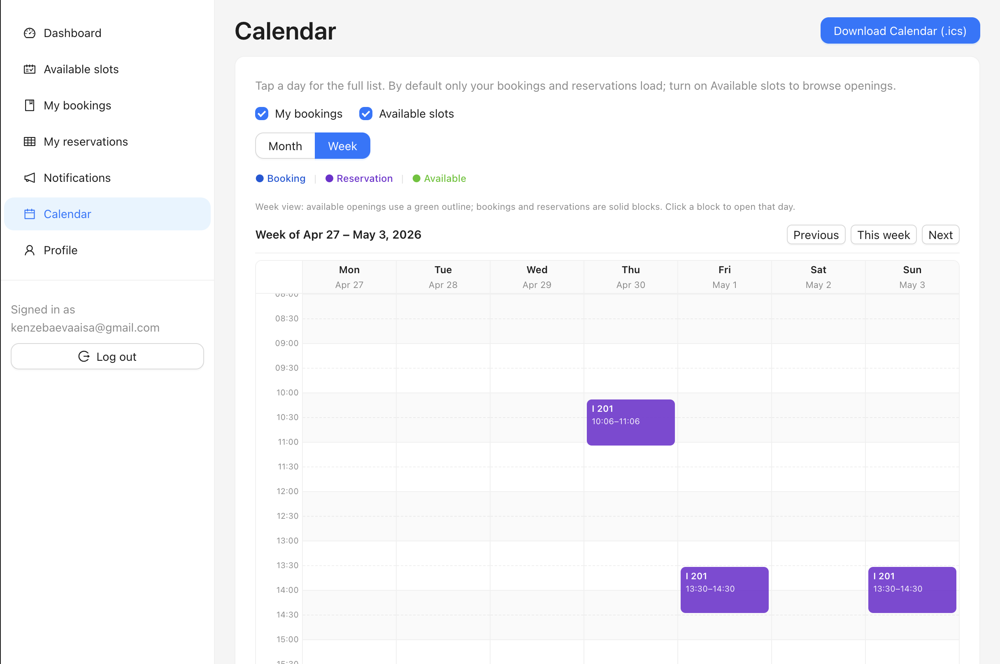

# Booking Time — Capstone Project Topic

## PROJECT CONTEXT

This project is a **University Booking System** that allows:

- Students to book time slots with professors  
- Professors to create and manage availability  
- Admins to monitor bookings and reservations  

**Includes:**

- Approval workflow (pending → approved/rejected)  
- Group bookings (multi-student)  
- Booking descriptions  
- Chat inside bookings  
- Notifications system  
- Calendar (month + week view)  
- Separation between bookings and classroom reservations  

---

### Application screenshots *(optional)*

Add images under [`docs/screenshots/`](docs/screenshots/) and embed them below for GitHub/GitLab previews.

| Area | Preview *(after you add files)* |
|------|-----------------------------------|
| Student dashboard / slots |  |
| Professor bookings / approvals |  |
| Admin analytics |  |
| Calendar week view |  |

*If images are missing, those lines show a broken thumbnail until files exist; remove unused rows or replace paths with your real filenames.*

---

## 1. Project Title

**Booking Time: University Office-Hours and Classroom Scheduling with Approval, Groups, and Unified Calendars**

## 2. Topic Area

Education Technology; Scheduling and Resource-Management Systems; Enterprise Web Applications

## 3. Problem Statement

Manual scheduling of professor office hours and ad hoc messages often wastes time, produces inconsistent records, and invites double bookings or overlapping commitments. Students and faculty lack a single place to request time, see availability, and clarify expectations before a meeting. Administrators cannot easily monitor demand, capacity, or classroom use across the institution. A dedicated, role-based system is needed to coordinate these activities with clear rules and auditability.

## 4. Proposed Solution

The system provides structured **slots** that professors define and students request, with configurable **capacity** and an explicit **approval workflow** (pending, approved, rejected, cancelled) so no seat is confirmed without policy compliance. **In-booking chat** and **optional descriptions** keep negotiation and context next to the reservation instead of in scattered email threads. A shared **calendar** (month and **week** views) and **notifications** give all roles timely visibility, while **classroom reservations** remain a separate flow from office-hour bookings so conflicts and reporting stay clear.

## 5. Target Users

- **Students:** discover availability, submit bookings, join group seats where allowed, message within a booking, and manage personal calendar context.  
- **Professors:** create and adjust slots, approve or reject requests, track occupancy, and communicate with students on specific bookings.  
- **University administrators:** oversee university-wide bookings and reservations, review activity, and support fair use of shared resources.

## 6. Technology Stack

| Layer | Technology |
|-------|-------------|
| **Frontend** | React (Vite + TypeScript + Ant Design) |
| **Backend** | FastAPI (Python) |
| **Database** | PostgreSQL |
| **Cloud / Hosting** | Vercel (frontend), Railway (backend and database) |
| **APIs / Integrations** | REST API |
| **Other tools** | *(Optional)* Redis or similar for caching/sessions; Celery or compatible workers for background jobs (e.g. notification delivery), if adopted in deployment |

## 7. Key Features

1. **Slot creation and lifecycle management** for office hours, including capacity and university scoping.  
2. **Booking with approval workflow**, status tracking, and cancellation consistent with academic policy.  
3. **Group (multi-student) bookings** within defined capacity, with visibility of participants where appropriate.  
4. **Per-booking chat** tied to a reservation for focused, traceable communication.  
5. **Notifications** for relevant events (requests, decisions, reminders) to reduce missed updates.  
6. **Calendar visualization** (month and week) plus separation of **office-hour bookings** from **classroom reservations** for clarity and scheduling integrity.

## 8. Team Members (with Email IDs)

| Name | Email | Role |
|------|--------|------|
| Aisha Kenzhebayeva | 230103248@sdu.edu.kz | Backend Developer |
| Zhansaya Medetkhanova | 230103275@sdu.edu.kz | Frontend Developer |
| Shynar Zhamay | 230103338@sdu.edu.kz | Data Analyst |

## 9. Expected Outcome

A **deployed, end-to-end web application** used by students, professors, and admins, with reliable booking and reservation flows, calendar views, and messaging. The institution gains **measurable improvement in scheduling efficiency**: fewer ad hoc conflicts, faster approval cycles, and clearer operational visibility than manual or fragmented tools.

## 10. Git Repo Link

**URL:** https://github.com/zhansayamm/capstone-project.git
